# WRO-Future-Engineers-2026

Documentation / Dokumentacija / Documentazione

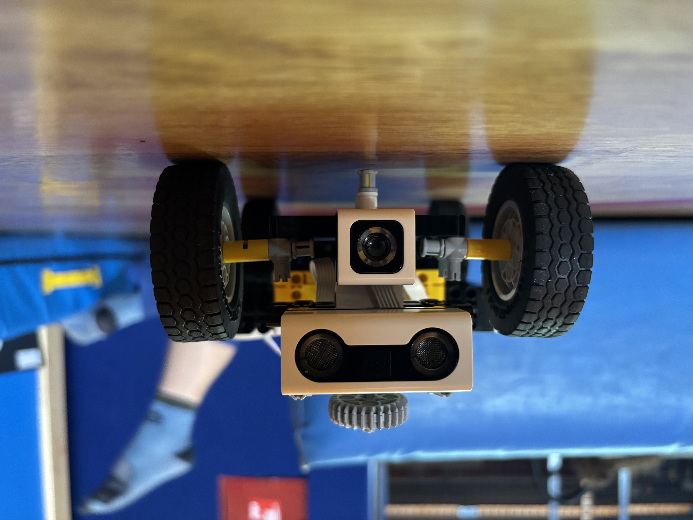

## Team

**WROsBros**

## Members

All team members were actively involved in the design, construction, programming, and testing of our robot, **Mishek**. Throughout the project, team members frequently changed roles and collaborated on different tasks.

Team members:

- Noa Markulin
- Jakov Gršeta
- Marko Mihalić

## Vehicle

Initially, we experimented with a 3D-printed chassis. However, it proved to be unreliable and difficult to maintain. Therefore, we redesigned the vehicle using LEGO components.

The final vehicle, called **Mishek**, was mainly assembled by Jakov Gršeta and is capable of autonomous navigation, obstacle avoidance, and parking maneuvers.

## Competition

### Open Challenge

**Objective:** The vehicle must successfully complete three laps on the track.

### Obstacle Challenge

**Objective:** The autonomous vehicle must complete three laps around the track while following all competition rules.

During the laps, the vehicle must correctly navigate around the traffic signs:

- Red traffic signs must be passed on the right side.
- Green traffic signs must be passed on the left side.

After completing the required laps, the vehicle must perform the parking mission. On the final lap, it must autonomously park in the designated parking area.

The vehicle must avoid collisions with walls, traffic signs, obstacles, and parking boundaries throughout the run.

## Mechanical Design

The robot is built according to the WRO Future Engineers rules. It uses a single motor to drive the rear wheels and a separate motor to steer the front wheels.

## Dimensions and Specifications

- Length: 25 cm
- Width: 15 cm
- Height 10 cm
- Weight: 0.6 kg

## Hardware

- Controller: LEGO SPIKE Prime Hub
- Distance Sensors: LEGO SPIKE Prime Distance Sensors
- Color Sensor: LEGO ColorDistance Sensor
- Driving Motor: LEGO Large Angular Motor
- Steering Motor: LEGO Medium Angular Motor

## Software

### 1. Wiring Diagram / Port Assignment

| Component | Device Type | Port | Function |
|-----------|-------------|------|----------|
| Distance Sensor | LEGO SPIKE Prime Distance Sensor | E | Front obstacle detection |
| Color Sensor | LEGO ColorDistance Sensor | A | Front obstacle detection and distance measurement |
| Driving Motor | LEGO Large Angular Motor | D | Rear-axle propulsion and velocity control |
| Steering Motor | LEGO Medium Angular Motor | C | Controls the steering angle of the front wheels |
| Distance Sensor | LEGO SPIKE Prime Distance Sensor | F | Side obstacle detection |
| Distance Sensor | LEGO SPIKE Prime Distance Sensor | B | Side obstacle detection |

### 2. Sensor Selection and Placement

The side-mounted distance sensors are positioned near the rear section of the vehicle. They are used to measure the distance from nearby walls and obstacles and can detect objects up to approximately 2 meters away.
The front-mounted distance sensor is used to measure the distance from the front wall to the vehicle

The Color Sensor is mounted at the front of the vehicle below the distance sensor and is used for obstacle identification and parking detection.

### 3. Obstacle and Parking Logic

#### Obstacle Avoidance

When an obstacle is detected within approximately 10 cm, the ColorDistance Sensor evaluates its RGB values.

- If red is the dominant color, the vehicle passes the obstacle on the right side.
- If green is the dominant color, the vehicle passes the obstacle on the left side.

#### Parking Mission

The software maintains an internal lap counter. After completing the required laps, the vehicle begins searching for the designated parking area.

Once the parking marker is detected, the robot stops and switches to a dedicated parking routine designed to position the vehicle inside the parking zone.

### 4. Navigation Algorithm

The robot uses three sensors mounted on the sides of the vehicle to estimate its position relative to the walls.

During normal driving, the software continuously compares the distance measured by both sensors and adjusts the steering angle to keep the vehicle centered on the track.

When a side wall is no longer detected, the robot recognizes an approaching corner and initiates a 90-degree turn using data from the built-in IMU.

## Development

### First Prototype

Our first prototype was built using 3D-printed parts. Although the design was promising, steering accuracy and overall reliability were insufficient for competition use.

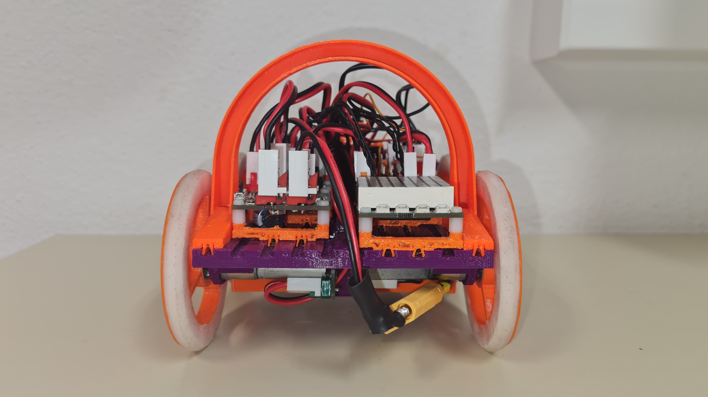

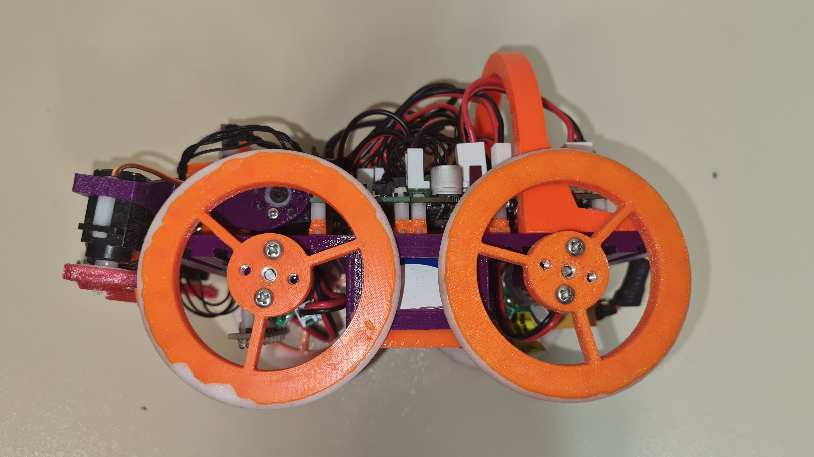

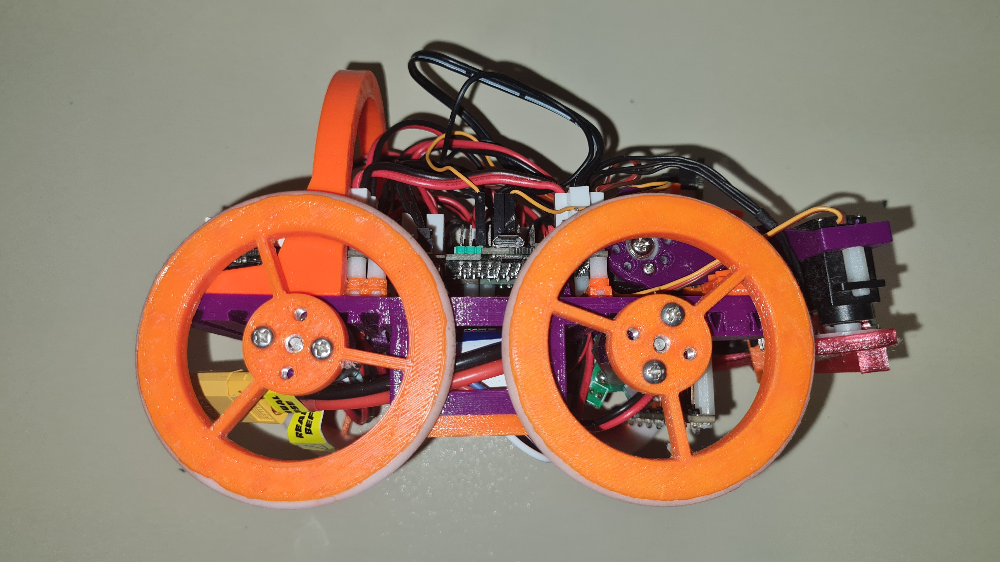

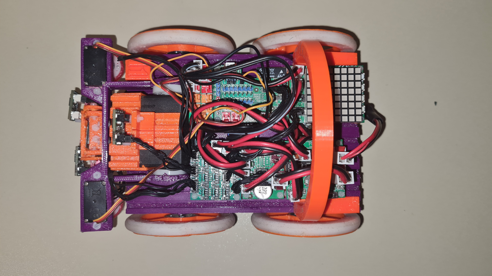

### Second Prototype

We developed a larger and improved 3D-printed vehicle with better wheel geometry and smoother movement.

Unfortunately, persistent communication issues between the robot and our computer prevented reliable testing and further development. Despite multiple troubleshooting attempts, including updating to Windows 11, the problems remained unresolved.

### 3D Model

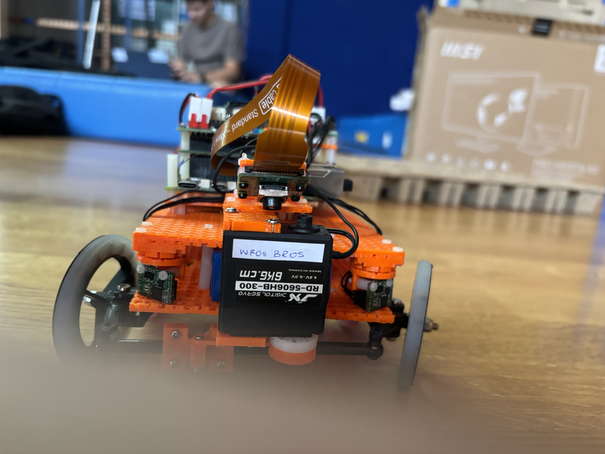

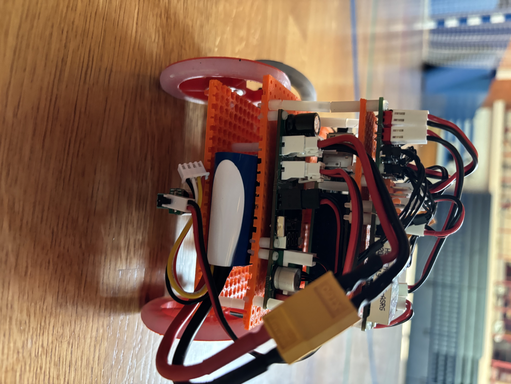

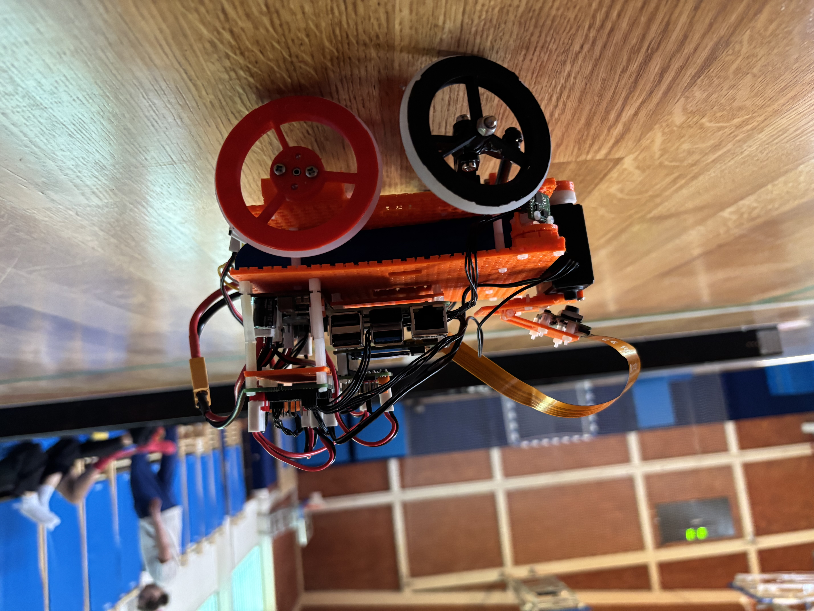

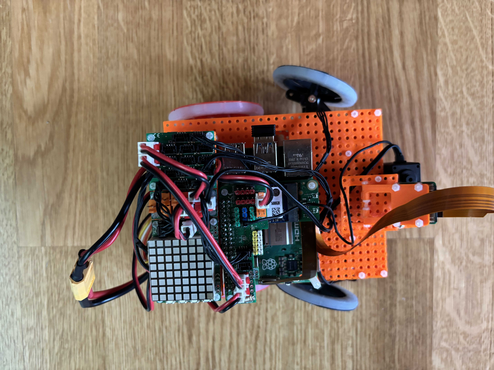

### Final Robot

As a result, we decided to build an entirely new LEGO-based vehicle named **Mishek**.

The final robot provides significantly improved reliability, easier maintenance, and better integration with the LEGO SPIKE Prime ecosystem.

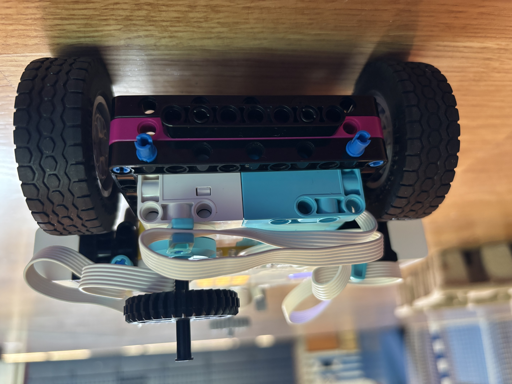

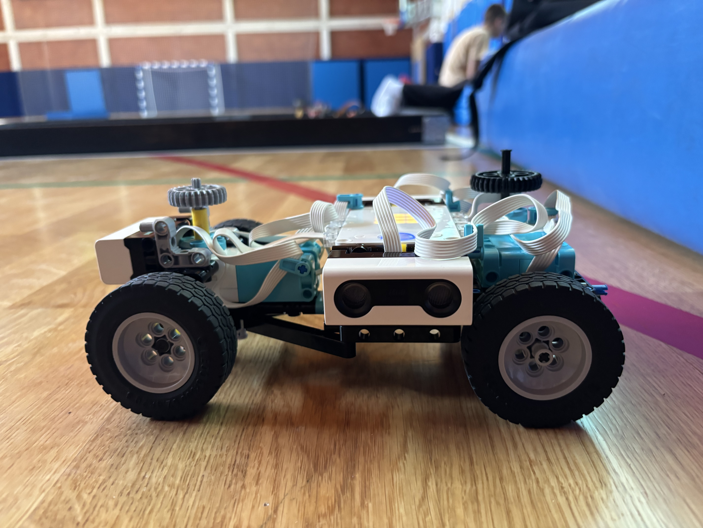

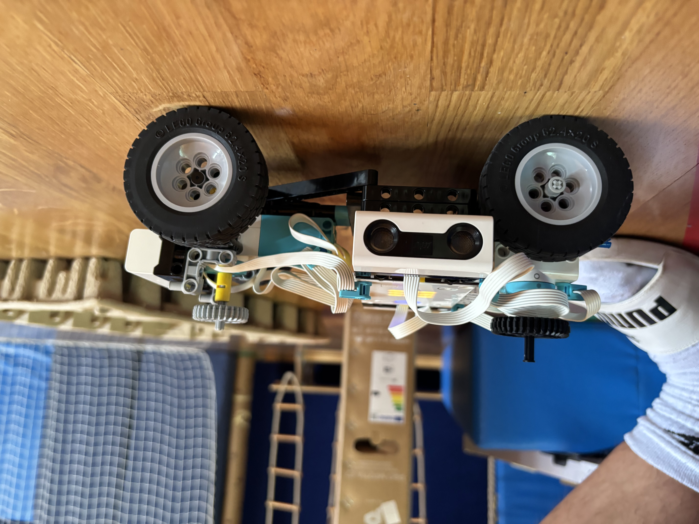

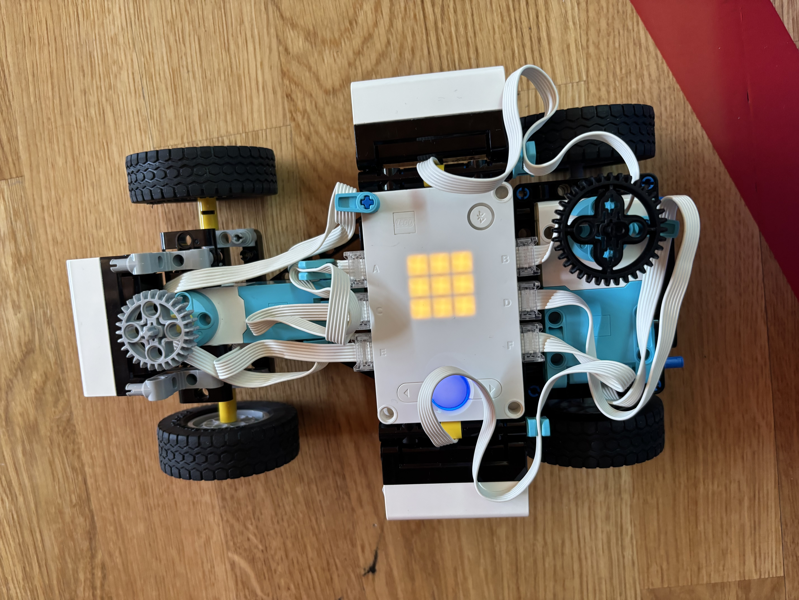

## Testing

The robot was tested on multiple track layouts to improve navigation accuracy, corner detection, obstacle avoidance, and parking performance.

Testing focused on:

- Maintaining a centered position on the track
- Detecting corners using side distance sensors
- Correctly identifying red and green obstacles
- Executing consistent 90-degree turns
- Performing autonomous parking maneuvers

## Future Improvements

- More accurate obstacle recognition
- Improved turning precision
- Faster lap completion times
- More reliable parking performance
- Enhanced navigation algorithms

## Final Code
from pybricks.hubs import PrimeHub
from pybricks.pupdevices import Motor, ColorSensor, UltrasonicSensor, ForceSensor, 
from pybricks.parameters import Button, Color, Direction, Port, Side, Stop
from pybricks.robotics import DriveBase
from pybricks.tools import wait, StopWatch

turning_motor = Motor(Port.C, Direction.CLOCKWISE)
driving_motor = Motor(Port.D, Direction.COUNTERCLOCKWISE)
distance_sensor_front = UltrasonicSensor(Port.E)
distance_sensor_left = UltrasonicSensor(Port.F)
distance_sensor_right = UltrasonicSensor(Port.B)
colour_sensor = ColorSensor(Port.A)

hub = PrimeHub()

#varijable
rWheel = 31.2 #polumjer kotača u mm
pi = 3.141592653589793
tolerance = 1 #tolerancija za korištenje funkcije turn()
resetAngle = -52 #kut za centriranje prednjih kotača za korištenje funkcije ResetTurningAngle()
stallSpeed = 600 #brzina kretanja motora turning_motor prilikom izvršavanja funckije ResetTurningAngle()
turningMotorSpeed = 1000 #brzina kretanja motora turning_motor za korištenje funckije ResetTurningAngle()
dutyLimit = 75 #jačina motora prilikom izvršavanja funkcije ResetTurningAngle()

#inicijalizacija
cWheel=2*rWheel*pi
#colour_sensor.lights.on()
colour_sensor.lights.off()  
distance_sensor_front.lights.on()
distance_sensor_left.lights.on()
distance_sensor_right.lights.on()
#distance_sensor_right.lights.off()
#distance_sensor_front.lights.off()

def ResetTurningAngle():
    turning_motor.run_until_stalled(stallSpeed, duty_limit=dutyLimit)
    turning_motor.reset_angle()
    turning_motor.run_angle(turningMotorSpeed,resetAngle)
    turning_motor.reset_angle()

def fd(v,s): #brzina, udaljenost    
    angle = (s/cWheel)*360
    driving_motor.reset_angle()
    driving_motor.run_angle(v,angle)

def turn(v,angle): #brzina, kut
    driving_motor.stop()
    hub.imu.reset_heading(0)
    if angle > 0:
        turning_motor.run_until_stalled(-stallSpeed, duty_limit=dutyLimit)
    else:
        turning_motor.run_until_stalled(stallSpeed, duty_limit=dutyLimit)
    driving_motor.run(v)
    while not abs(hub.imu.heading()) >= abs(angle)+tolerance or abs(hub.imu.heading()) <= abs(angle)-tolerance:
        wait(5)
    driving_motor.stop()
    ResetTurningAngle()
    ResetTurningAngle()
driving_motor.run(1000)
while hub.imu.heading() <= 1100:
    #left/right 150-200-300
    #front 235-300-400
    if distance_sensor_front.distance() <= 400: #FRONT
        if distance_sensor_front.distance() <= 235:
            turning_motor.run_angle(-resetAngle)
            driving_motor.run(300)
        elif distance_sensor_front.distance() <= 300:
            turning_motor.run_angle(-resetAngle/2)
            driving_motor.run(500)
        else:
            turning_motor.run_angle(-resetAngle/4)
            driving_motor.run(800)
        wait(10)
    elif distance_sensor_right.distance() <= 300: #RIGHT
        if distance_sensor_right.distance() <= 150:
            turning_motor.run_angle(resetAngle/2)
            driving_motor.run(300)
        elif distance_sensor_right.distance() <= 200:
            turning_motor.run_angle(resetAngle/4)
            driving_motor.run(500)
        else:
            turning_motor.run_angle(resetAngle/8)
            driving_motor.run(800)
        wait(10)
    elif distance_sensor_left.distance() <= 300: #LEFT
        if distance_sensor_left.distance() <= 150:
            turning_motor.run_angle(-resetAngle/2)
            driving_motor.run(300)
        elif distance_sensor_left.distance() <= 200:
            turning_motor.run_angle(-resetAngle/4)
            driving_motor.run(500)
        else:
            turning_motor.run_angle(-resetAngle/8)
            driving_motor.run(800)
        wait(10)
    else:
        turning_motor.run_angle(0)
        driving_motor.run(1000)
driving_motor.stop()        
